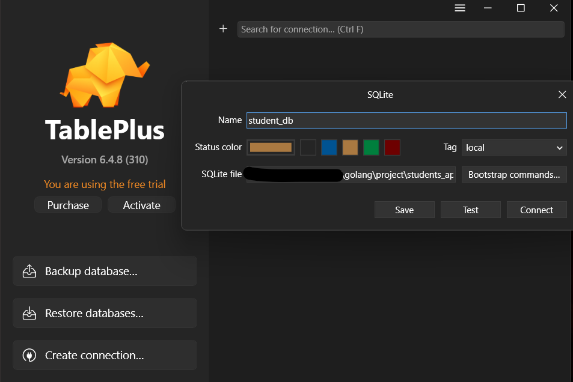
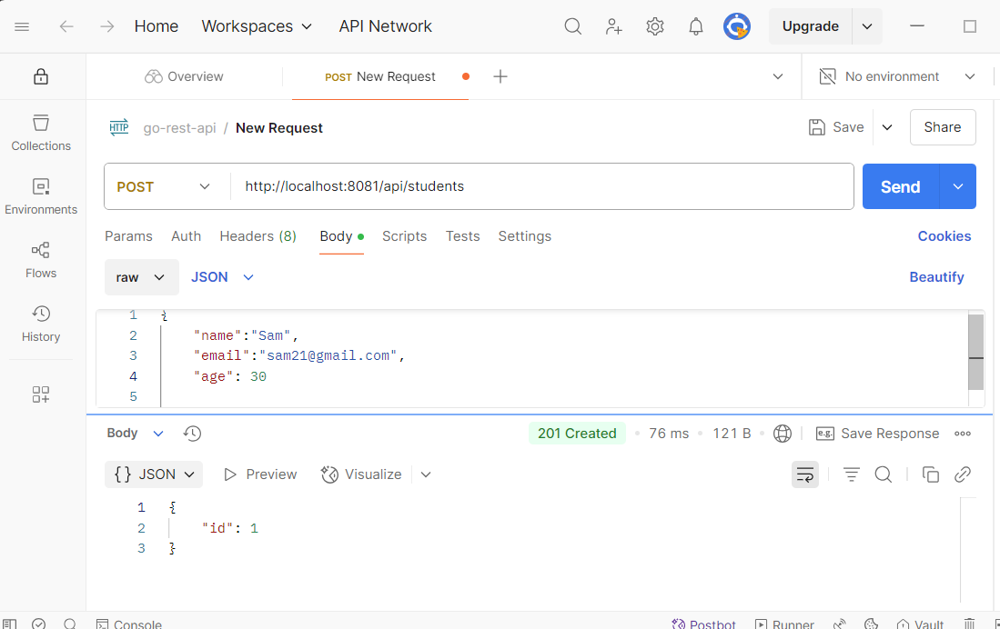
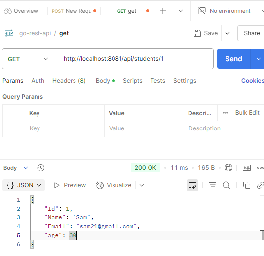

# Students REST API project


### Tools/Packages Required

[MinGW64, TablePlus(for GUI of database) ]

### packages

database/sql:
```
This package provides a generic interface to databases that use SQL. It allows you to connect to and interface with different databases by providing the queries and statements to execute.

In addition to the package database/sql, you need access to a specific driver to connect to the required database. 

The driver works together with the database/sql package, implementing the details to interface with the desired database engine. 

The sql package in Go provides a general interface to SQL (or SQL-like) databases. A database driver must be used in conjunction with the sql package.
```

__To install this package, run the below command:__

```go
go get github.com/mattn/go-sqlite3
```

__Example to check SQLite3 Database!:__

```go
package main

import (
	"database/sql"
	"fmt"
	"log"
	_ "github.com/mattn/go-sqlite3"
)

func main() {
	db, err := sql.Open("sqlite3", ":memory:")

	if err != nil {
		log.Fatal(err)
	}

	defer db.Close()

	var version string
	err = db.QueryRow("SELECT SQLITE_VERSION()").Scan(&version)

	if err != nil {
		log.Fatal(err)
	}
	fmt.Println(version)
}
```

We will be using TablePlus for Graphical User Interface



<hr>

__after calling the API via postman__

__POST Request__
``` http://localhost:8081/api/students```



<hr>

__GET Request__
``` http://localhost:8081/api/students/1```


