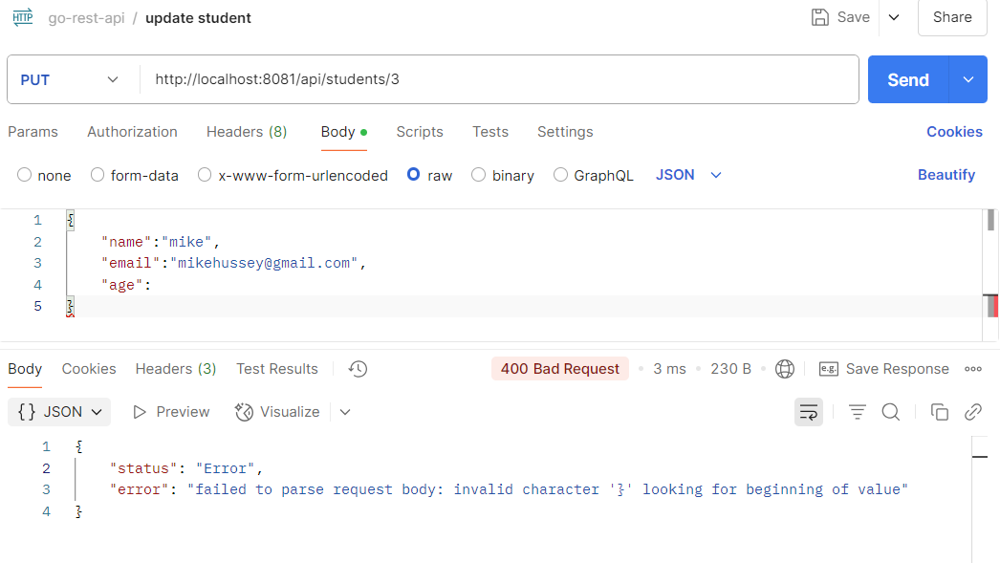

# Students REST API project

### project structure 

```
students_api
├── assets
├── cmd
│   └── students_api
│       └── main.go
├── internal
│   ├── config
│   │   └── config.go
│   ├── http
│   │   └── handlers
│   │       └── student
│   │           └── student.go
│   ├── storage
│   │   ├── storage.go
│   │   └── sqlite
│   │       └── sqlite.go
│   ├── types
│   │   └── types.go
│   └── utils
│       └── response
│           └── response.go
└── README.md
```

<hr>

### 1. Project Structure Explanation
The project follows a clean, modular Go project structure:
- `cmd/`: Contains the main application entry point
- `internal/`: Houses core application logic
  - `config/`: Configuration management
  - `http/handlers/`: HTTP request handlers
  - `storage/`: Database interaction layer
  - `types/`: Data models and structs
  - `utils/`: Utility functions

### 2. Key Components
- **Main Application**: 
  - Loads configuration
  - Initializes SQLite storage
  - Sets up HTTP routes
  - Configures server with graceful shutdown

- **Storage**: 
  - Uses SQLite as the database
  - Implements CreateStudent method
  - Auto-creates `students` table on startup

- **Handlers**: 
  - Implements RESTful endpoints for students
  - Supports:
    - Creating a student (`POST /api/students`)
    - Retrieving student by ID (`GET /api/students/{id}`)
    - Listing students (`GET /api/students`)
  - Includes request validation using `go-playground/validator`
  - Structured error handling

### 3. Technologies Used
- Language: Go
- Database: SQLite
- Validation: go-playground/validator
- Logging: Go's standard `slog`

### 4. Strengths
- Clean, modular architecture
- Separation of concerns
- Robust error handling
- Request validation
- Structured logging
- Simple SQLite storage

### 5. Potential Improvements
- Add more comprehensive error messages
- Implement update and delete student endpoints
- Add pagination for student listing
- Implement more advanced querying
- Add authentication/authorization
- Create comprehensive test suite

### 6. Overall Assessment
A well-structured, clean Go API for managing student records with a focus on simplicity and modularity. Good for learning or as a starting point for more complex applications.

<hr>

### Tools/Packages Required

[MinGW64, TablePlus(for GUI of database),Postman, go-playground/validator, github.com/mattn/go-sqlite3 ]

### packages

database/sql:
```
This package provides a generic interface to databases that use SQL. It allows you to connect to and interface with different databases by providing the queries and statements to execute.

In addition to the package database/sql, you need access to a specific driver to connect to the required database. 

The driver works together with the database/sql package, implementing the details to interface with the desired database engine. 

The sql package in Go provides a general interface to SQL (or SQL-like) databases. A database driver must be used in conjunction with the sql package.
```

__To install this package, run the below command:__

```go
go get github.com/mattn/go-sqlite3
```

__Example to check SQLite3 Database!:__

```go
package main

import (
	"database/sql"
	"fmt"
	"log"
	_ "github.com/mattn/go-sqlite3"
)

func main() {
	db, err := sql.Open("sqlite3", ":memory:")

	if err != nil {
		log.Fatal(err)
	}

	defer db.Close()

	var version string
	err = db.QueryRow("SELECT SQLITE_VERSION()").Scan(&version)

	if err != nil {
		log.Fatal(err)
	}
	fmt.Println(version)
}
```

We will be using TablePlus for Graphical User Interface


<hr>

__after calling the API via postman__

__POST Request__
``` http://localhost:8081/api/students```


<hr>

__GET Request__
``` http://localhost:8081/api/students/1```


<hr>

__PUT Request__
``` http://localhost:8081/api/students/1```


<hr>

### update errors & Handling

Error when someone tries to update record that doesn't exist


<hr>

#### Error when age field is missing



